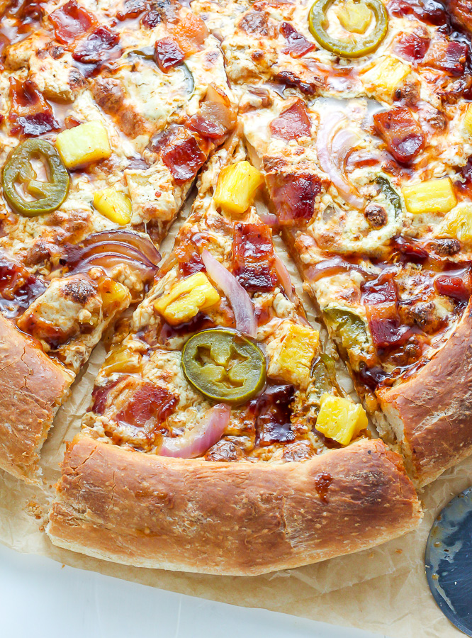

# PizzA
## Pizza is a Italian dish. 
There are different types and styles of pizza.
- Brooklyn style
- Handmade pan pizza
- Hand tossed 
- Thin crust

@copyright Delish

And there are also different sauces which makes pizza delicious
1. Alfredo sauce
2. Garlic parmesan
3. Barbeque sauce 

### Toppings in pizza 

They are usually Veg and Meat toppings. 

@copyright delish

 Veg Toppings                       

* Onions                              

* Spinach                             

* Mushrooms                           

* Bell peppers                        

* Jalapenos

@copyright delish

Meat Toppings

* Chicken

* Beacon

* Ham

* Turkey

* pepperoni

Reference 

[Dominos](https://www.dominos.com/en/)

[Pizza hut](https://www.pizzahut.com/index.php?menu=pizza#/menu/pizza)

[papajohns](https://www.papajohns.com/order/menu)
